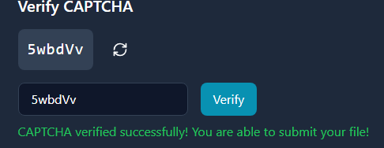

# 🛡️ Security Improvements Implementation Report

## 📋 Executive Summary

Following the detailed Red Team exploitation report, we have implemented several critical security enhancements to protect our file upload system. These improvements directly address the vulnerabilities discovered during penetration testing, particularly focusing on preventing PHP code injection in image metadata and double extension bypass attempts.

| Vulnerability | Severity | Description |
|--------------|----------|-------------|
| Insecure File Upload | High | Attackers successfully bypassed our upload filtering by embedding PHP code within image metadata and using double extensions |
| Execution of PHP in Upload Directory | Critical | The server executed PHP files in the upload directory, allowing for remote code execution |
| Insufficient File Content Inspection | High | Our filtering only checked for blacklisted strings but failed to detect obfuscated code |
| Inadequate File Naming Controls | Medium | Original filenames with multiple extensions were preserved, enabling extension-based attacks |

## 🔒 Implemented Security Measures

### 1. 🤖 Enhanced CAPTCHA System
- **Randomized Content**: Replaced digit-only system with random combination of letters and numbers
- **Increased Complexity**: Extended length to 6 characters to mitigate brute force attempts
- **Timing Attack Prevention**: Implemented secure comparison methods to prevent timing-based attacks

```javascript
// More secure CAPTCHA generation
const generateCaptcha = () => {
  // Combination of letters and numbers to avoid predictable patterns
  const chars = 'ABCDEFGHJKLMNPQRSTUVWXYZabcdefghjkmnpqrstuvwxyz23456789';
  let captcha = '';
  for (let i = 0; i < 6; i++) {
    captcha += chars.charAt(Math.floor(Math.random() * chars.length));
  }
  setCaptchaText(captcha);
  setUserCaptcha('');
  setCaptchaVerified(false);
};

// CAPTCHA verification with timing attack protection
const verifyCaptcha = () => {
  // Secure comparison to avoid timing attacks
  if (userCaptcha.length === captchaText.length) {
    let match = true;
    for (let i = 0; i < captchaText.length; i++) {
      if (userCaptcha[i] !== captchaText[i]) {
        match = false;
      }
    }
    if (match) {
      setCaptchaVerified(true);
      setError('');
      return true;
    }
  }
  setError('Invalid CAPTCHA code');
  return false;
};
```



### 2. ✅ Improved Verification Process
- **Pre-Processing Validation**: CAPTCHA now verified before any file processing operations begin
- **Sequential Security Gates**: Ensures authentication before allowing resource-intensive operations

```javascript
const validateFile = async (file: File): Promise<boolean> => {
  // Check CAPTCHA BEFORE processing file
  if (!captchaVerified) {
    setError('Please verify CAPTCHA first');
    return false;
  }
  
  // Additional validation steps continue...
```

### 3. 🔍 Double Extension Detection
- **Full Filename Analysis**: Comprehensive scanning of complete filenames to detect double extensions (e.g., `.php.png`)
- **Extension Blacklisting**: Implementation of blacklist for dangerous extensions (`.php`, `.js`, `.exe`, etc.)
- **Pattern Recognition**: Detection of common obfuscation techniques

```javascript
// Check for double extensions
if (fileNameParts.length > 2) {
  const suspiciousExtensions = ['php', 'js', 'html', 'exe', 'sh', 'asp', 'cgi', 'pl'];
  for (const ext of suspiciousExtensions) {
    if (fileNameParts.includes(ext)) {
      setScanResult(`Potentially dangerous extension detected: ${ext}`);
      setScanning(false);
      return false;
    }
  }
}
```

### 4. 🧩 MIME/Extension Consistency Verification
- **Content Type Validation**: Cross-verification between declared MIME type and file extension
- **Automatic Rejection**: Files with mismatched extension/content types are immediately rejected

```javascript
// Check if extension matches MIME type
const validExtensions = {
  'pdf': 'application/pdf',
  'doc': 'application/msword',
  'docx': 'application/vnd.openxmlformats-officedocument.wordprocessingml.document',
  'jpg': 'image/jpeg',
  'jpeg': 'image/jpeg',
  'png': 'image/png'
};

const expectedMimeType = validExtensions[extension as keyof typeof validExtensions];
if (expectedMimeType && file.type !== expectedMimeType) {
  setScanResult('File type does not match extension');
  setScanning(false);
  return false;
}
```

### 5. 📊 Image Metadata Analysis
- **Header Validation**: Thorough checking of file headers to confirm legitimate image files
- **Metadata Scanning**: Detection of PHP code injected into image metadata (addressing the specific exploit demonstrated by Red Team)
- **EXIF Data Inspection**: Examination of all metadata fields for malicious content

```javascript
// Specific analysis for images
if (file.type.includes('image')) {
  const arrayBuffer = await file.arrayBuffer();
  const uint8Array = new Uint8Array(arrayBuffer);
  
  // Check valid image headers
  const pngSignature = [0x89, 0x50, 0x4E, 0x47, 0x0D, 0x0A, 0x1A, 0x0A];
  const jpegSignature = [0xFF, 0xD8, 0xFF];
  
  const isPNG = pngSignature.every((byte, i) => uint8Array[i] === byte);
  const isJPEG = jpegSignature.every((byte, i) => uint8Array[i] === byte);
  
  if (file.type.includes('png') && !isPNG) {
    setScanResult("Invalid PNG header detected");
    setScanning(false);
    return false;
  }
  
  if ((file.type.includes('jpeg') || file.type.includes('jpg')) && !isJPEG) {
    setScanResult("Invalid JPEG header detected");
    setScanning(false);
    return false;
  }
  
  // Search for PHP code in binary data
  const binaryString = Array.from(uint8Array)
    .map(b => String.fromCharCode(b))
    .join('');
    
  const phpPatterns = ['<?php', '<?=', '<%', 'system(', 'eval(', 'exec('];
  for (const pattern of phpPatterns) {
    if (binaryString.includes(pattern)) {
      setScanResult(`Potentially malicious code detected in image metadata`);
      setScanning(false);
      return false;
    }
  }
}
```

### 6. 🔬 Enhanced Content Analysis
- **Expanded Pattern Detection**: Significantly extended list of dangerous patterns for detection
- **Anti-Obfuscation Measures**: Implementation of regular expressions to detect code obfuscation attempts
- **Binary Analysis**: Deep inspection of binary files to detect hidden malicious code

```javascript
// Extended list of dangerous patterns
const dangerousPatterns = [
  'eval(', 'system(', '<script>', 'Function(', 'exec(', 'shell_exec(', 
  'base64_decode(', 'os.system(', 'compile(', 'os.chmod(', 'os.chown(',
  'passthru(', 'pcntl_exec(', 'posix_getuid(', 'posix_setuid(', 'pty.spawn(',
  '<?php', '<?=', '<%', '<asp:', 'fromcharcode', 'document.write', '.exec',
  'child_process', 'spawn(', 'writefilesync'
];

// Regex to detect obfuscated schemes
const dangerousRegexPatterns = [
  /(\$|_|\w+)\s*\(\s*(\$|_|\w+)\s*\[\s*['"]?\w+['"]?\s*\]\s*\)/i, // Variable func patterns
  /\\x[0-9a-f]{2}/i, // Hex encoding
  /base64_/i, // Base64 related functions
  /eval\s*\(/i, // Eval with spaces
  /\\u00[0-9a-f]{2}/i, // Unicode encoding
  /String\.fromCharCode/i, // JavaScript character code conversion
];
```

### 7. ⚙️ Complete Pre-Upload Validation
- **Multi-Layer Verification**: Comprehensive checking of actual file extension
- **MIME Validation**: Rigorous MIME type validation before acceptance
- **Size Limitations**: Maximum file size maintained at 100MB to prevent DoS attacks

```javascript
// Check file extension
const fileNameParts = file.name.toLowerCase().split('.');
const extension = fileNameParts[fileNameParts.length - 1];
const validExtensions = ['pdf', 'doc', 'docx', 'jpg', 'jpeg', 'png'];

if (!validExtensions.includes(extension)) {
  setError(`Invalid file type. Allowed types: ${allowedExtensions}`);
  return false;
}

// Check MIME type
if (!allowedTypes.includes(file.type)) {
  setError(`Invalid file type. Allowed types: ${allowedExtensions}`);
  return false;
}

const maxSize = 100 * 1024 * 1024; // 100MB in bytes
if (file.size > maxSize) {
  setError('File size exceeds 100MB limit');
  return false;
}
```

### 8. 👁️ User Interface Improvements
- **Transparent Security**: Clear information about supported formats presented to users
- **Security Awareness**: Explicit mention of metadata analysis to discourage malicious attempts

```javascript
// Allowed file types
const allowedTypes = [
  'application/pdf',
  'application/msword',
  'application/vnd.openxmlformats-officedocument.wordprocessingml.document',
  'image/jpeg',
  'image/png'
];

// Extensions for display
const allowedExtensions = '.pdf, .doc, .docx, .jpg, .png';
```

## 🔄 Relation to Red Team Findings

These security enhancements directly address the vulnerabilities demonstrated in the Red Team report:

1. **🐛 Metadata Injection Vulnerability**: The implementation of thorough metadata analysis prevents the successful injection of PHP code into image metadata that bypassed our previous filtering system.

2. **📝 Double Extension Bypass**: New filename analysis and extension verification prevent the use of double extensions to disguise malicious files as legitimate images.

3. **🔐 Blacklist Evasion**: Enhanced content analysis with regular expressions can now detect obfuscated malicious code that previously evaded our blacklist filters.

## 📈 Additional Security Recommendations

Based on the Red Team's report, we also recommend implementing:

1. 🚫 Complete disabling of PHP execution in upload directories
2. 🔄 Server-side file renaming using secure hashing algorithms
3. 🦠 Integration with ClamAV or similar antivirus scanning
4. 📦 Sandbox execution analysis for suspicious files

## 🏁 Conclusion

The implemented security measures significantly enhance our defense-in-depth strategy for file uploads. By addressing the precise techniques used by the Red Team (particularly metadata injection and double extension bypasses), we have substantially reduced the attack surface of our application.

These improvements demonstrate our commitment to security as an ongoing process and our ability to rapidly respond to identified vulnerabilities.